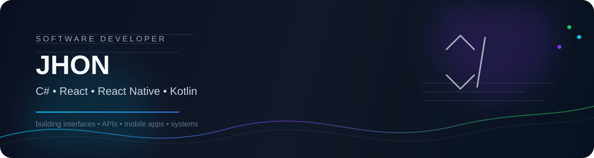

<div align="center">
  
</div>

<br/>

<div align="center">

<a href="https://github.com/joots28">
  
</a>
<a href="https://www.linkedin.com/in/jonathan-otiniel-053a12290">
  
</a>
<a href="mailto:jonathanotiniel@gmail.com">
  
</a>

</div>

<div align="center">
  
</div>

---

## 👨‍💻 Sobre mim

> **Desenvolvedor de Sistemas em formação**, apaixonado por transformar ideias em aplicações reais.

Gosto de trabalhar entre **backend, frontend e mobile**, explorando desde a lógica e arquitetura de sistemas até interfaces modernas e experiências de usuário.

Meu foco atual está em quatro tecnologias que quero levar cada vez mais a fundo:

<div align="center">

| ⚙️ Backend | ⚛️ Frontend | 📱 Mobile | 🚀 Android |
|:---:|:---:|:---:|:---:|
| **C# / .NET** | **React** | **React Native** | **Kotlin** |
| APIs • lógica • sistemas | UI • componentes • web | apps multiplataforma | apps Android • Kotlin |

</div>

---

# 🧠 Minha Stack

<div align="center">

### ⭐ Stack principal

<a href="https://learn.microsoft.com/dotnet/csharp/"></a>
<a href="https://dotnet.microsoft.com/"></a>
<a href="https://react.dev/"></a>
<a href="https://reactnative.dev/"></a>
<a href="https://kotlinlang.org/"></a>

<br/>

### 🌐 Web & Base


### 🧰 Ferramentas


</div>

---

## 🎯 Atualmente focado em

<div align="center">

```text
┌─────────────────────────────────────────────────────────────┐
│  C# / .NET        → APIs, sistemas, arquitetura e backend  │
│  React            → interfaces, componentes e aplicações  │
│  React Native     → aplicações mobile multiplataforma    │
│  Kotlin           → desenvolvimento Android               │
└─────────────────────────────────────────────────────────────┘
```

</div>

---

## 🚀 O que estou construindo

**Backend & APIs**  
Aplicações em C#/.NET com foco em organização de código, regras de negócio e integração entre serviços.

**Frontend**  
Interfaces em React com componentes reutilizáveis, responsividade e atenção à experiência do usuário.

**Mobile**  
Projetos com React Native para aplicações multiplataforma e estudos em Kotlin para o ecossistema Android.

**Fundamentos**  
Lógica de programação, estruturas condicionais, orientação a objetos, Git/GitHub e construção de projetos do zero.

---

## 📂 Projetos

<div align="center">

<a href="https://github.com/joots28/SPIUsuarios_2DS">
  
</a>
<a href="https://github.com/joots28/site_garido">
  
</a>

<br/>

<a href="https://github.com/joots28/estruturas-condicionais">
  
</a>
<a href="https://github.com/joots28/lanchonete">
  
</a>

</div>

---

## 📊 GitHub Analytics

<div align="center">


<br/><br/>


<br/><br/>


</div>

---

## 🏆 GitHub Achievements

<div align="center">


</div>

---

## 💡 Filosofia de desenvolvimento

<div align="center">

> **Código bom não é só código que funciona.**  
> É código que pode ser entendido, mantido e evoluído.

</div>

---

## 🌐 Vamos nos conectar?

<div align="center">

<a href="https://github.com/joots28">
  
</a>
<a href="https://www.linkedin.com/in/jonathan-otiniel-053a12290">
  
</a>
<a href="mailto:jonathanotiniel@gmail.com">
  
</a>

<br/><br/>


</div>

---

<div align="center">

### ✨ Construindo projetos. Aprendendo tecnologias. Evoluindo como desenvolvedor.

</div>
